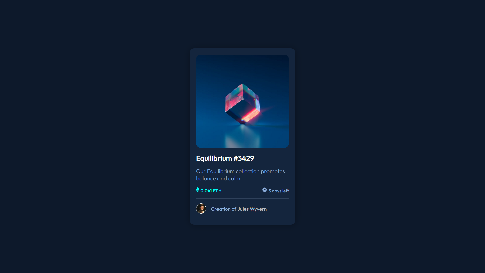

# Frontend Mentor - NFT Card Design

This is a solution to the NFT preview card component challenge on Frontend Mentor.

  <a href="#built-with">Technologies</a>&nbsp;&nbsp;&nbsp;|&nbsp;&nbsp;&nbsp;
  <a href="#Links">Links</a>&nbsp;&nbsp;&nbsp;|&nbsp;&nbsp;&nbsp;
  <a href="#License">License</a>

 

  

  

## Built with

> - [HTML](https://html.spec.whatwg.org/multipage/)
> - [CSS](https://www.w3.org/Style/CSS/Overview.en.html)

## Author

- Website - [Ladislau Paiva](https://ladislaubpaiva.pages.dev)
- Twitter - [@ladislaubpaiva](https://www.twitter.com/ladislaubpaiva)

## Links

- Live Site URL: [NFT Card](https://ladislaubpaiva.github.io/challenges/nft-card)

## License

This project is under the **MIT license**. See the [/LICENSE](LICENSE) file for more details.

---

Design by Frontend Mentor | Coded by Ladislau Paiva
